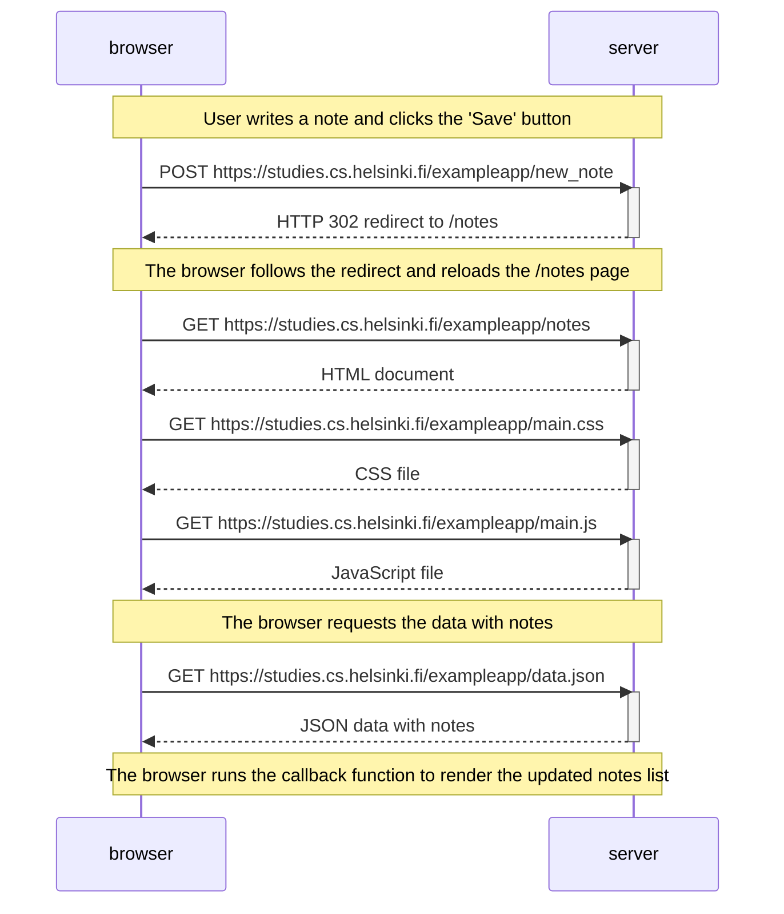

### Adding a new note in the traditional web app

This sequence diagram outlines the steps involved when a user adds a new note in the traditional web app at [https://studies.cs.helsinki.fi/exampleapp/notes](https://studies.cs.helsinki.fi/exampleapp/notes).

1. The user writes a note and clicks the 'Save' button.

2. The browser sends a POST request with the new note to the server.

3. The server responds with an HTTP 302 redirect to reload the /notes page.

4. The browser follows the redirect and requests the /notes page again, causing multiple requests to fetch the HTML document, CSS file, JavaScript file, and data.json.

5. The JavaScript code executes, fetching the existing notes and rendering the updated list that includes the new note.

Here’s the sequence diagram:

