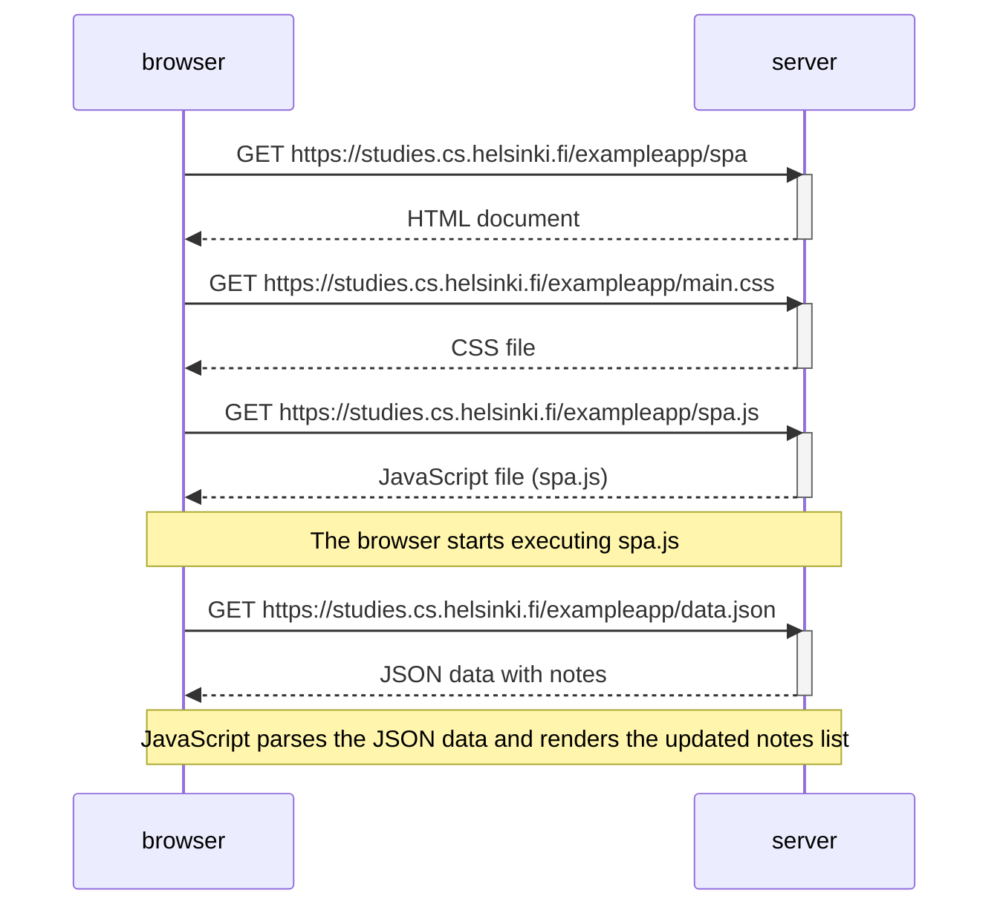

### Loading the SPA version of the notes app

The sequence diagram shows the steps involved when a user visits the SPA version of the notes app at [https://studies.cs.helsinki.fi/exampleapp/spa](https://studies.cs.helsinki.fi/exampleapp/spa).

1. The browser requests the HTML document, CSS file, and JavaScript file (spa.js) from the server.

2. Once the JavaScript file is loaded, it starts executing.

3. The JavaScript code makes an additional request to fetch the existing notes from `data.json`.

4. Upon receiving the JSON data, the JavaScript code parses it and updates the notes list on the page dynamically without reloading it.

Here’s the sequence diagram:

