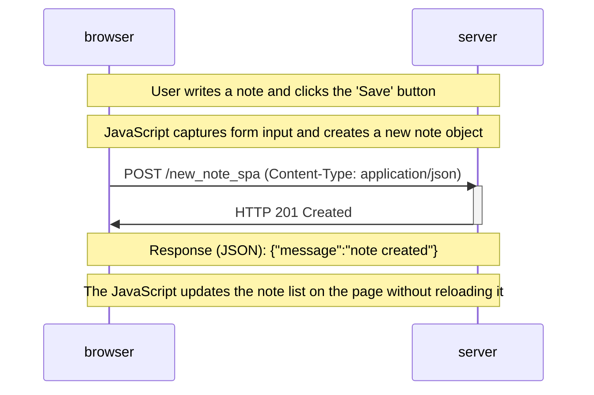

### Adding a new note in the single-page app (SPA)

This sequence diagram outlines the steps involved when a user adds a new note in the single-page app version of the notes app at [https://studies.cs.helsinki.fi/exampleapp/spa](https://studies.cs.helsinki.fi/exampleapp/spa).

1. The user writes a note and clicks the 'Save' button.

2. The form submission is handled by JavaScript to prevent a full-page reload.

3. JavaScript captures the form input and creates a new note object.

4. JavaScript sends the new note to the server via a POST request without reloading the page.

5. The server responds with a status code 201 (Created).

6. JavaScript updates the note list on the page dynamically to include the new note.

Here's the updated sequence diagram:

